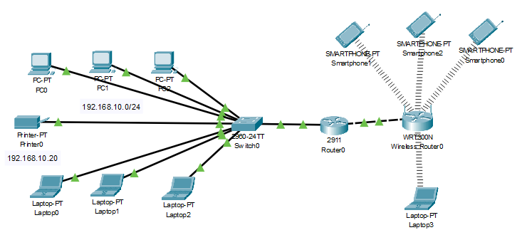
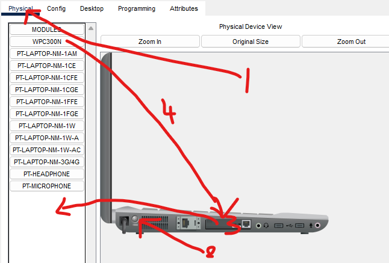
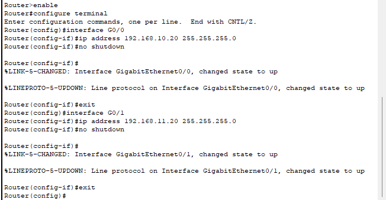
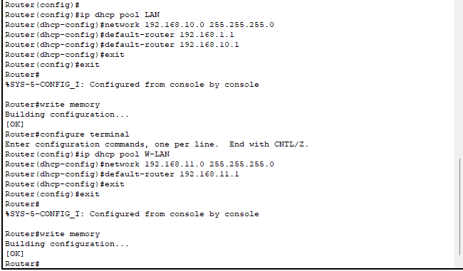
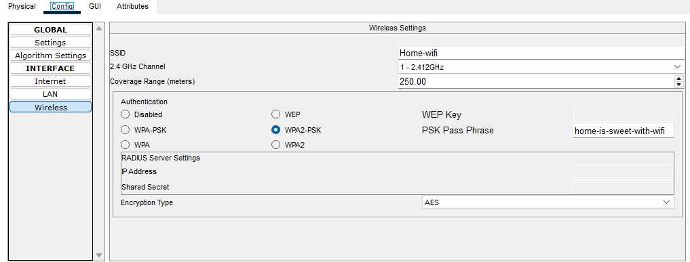
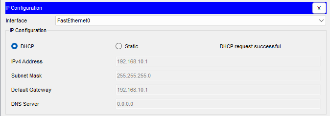
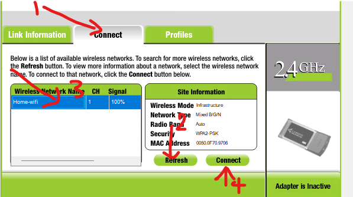
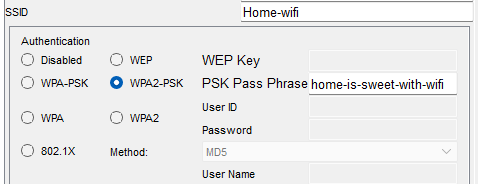
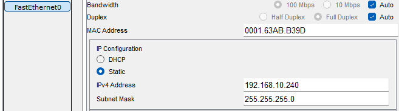
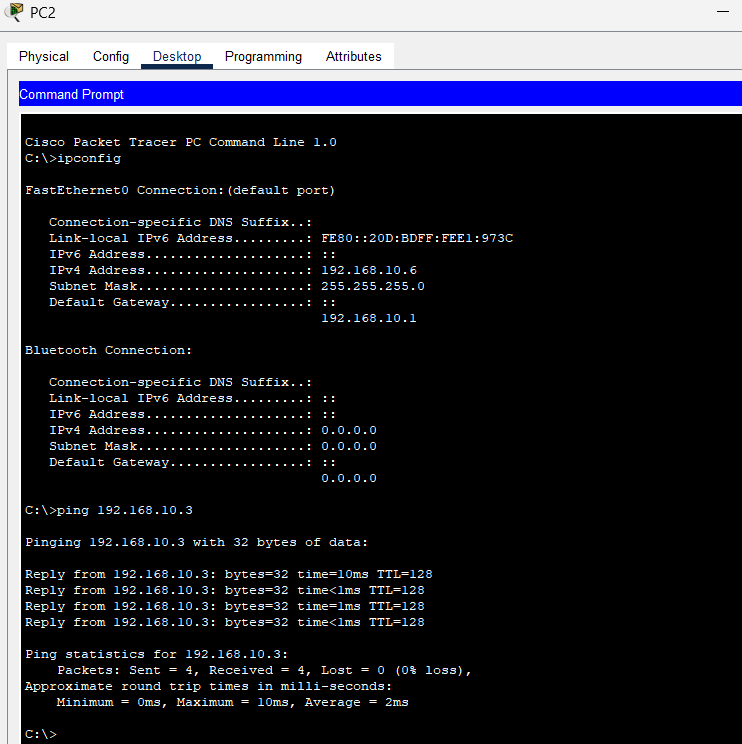

# Basic Lan configuration 

### Objective 
To simulate a small office network with Multiple end user devices, all connected to the same LAN. The router will provide DHCP to all devices, and testing the connectivity between them.

### Software Requirements:
- CISCO Packet Trace

### lab Setup



### Configuration 

1. Open Cisco Packet Tracer.
2. From the End Devices section, drag and drop the multiple into the workspace.
3. From the Network Devices section, drag and drop:
- 1 Router (Router-0)
- 1 Switch (Switch-0)
- 1 Wireless Router (WirelessRouter-0)

### Step 2: Physically Connect Devices

#### Wired Connections
1. Click on the cable icon and select a copper straight-through cable.
2. Connect each End devices to the Switch using the copper straight-through cable.
3. Connect the Printer to the Switch 
4. Connect the Router to the Switch using a straight-through cable. 

#### Wireless Connections
1. Connect WirelessRouter-0 to the Router using a crossover cable to connect.
2. For the wireless laptop 
  2.  power off the laptop 
  3.  Drag and drop the ethernet port out of the socket
  4.  Drop and drop the Wifi adapter into the socket
  5.  Power on the Laptop



### Step 3: Configure the Router

1. Click on your Router, go to the CLI tab.
2. Configure the Router’s GigabitEthernet 0/0 interface
```
Would you like to enter the initial configuration dialog? [yes/no]: no
Router> enable
Router# configure terminal
Router(config)# interface G0/0
Router(config-if)# ip address 192.168.10.1 255.255.255.0
Router(config-if)# no shutdown
Router(config-if)# exit
```

3. Configure the Router’s GigabitEthernet 0/1 interface (for WirelessRouter-0):
```
Router(config)# interface G0/1
Router(config-if)# ip address 192.168.11.1 255.255.255.0
Router(config-if)# no shutdown
Router(config-if)# exit
```




4. Set up a DHCP Pool for wired devices on the 192.168.10.0/24 network:

```
Router(config)# ip dhcp pool LAN
Router(dhcp-config)# network 192.168.10.0 255.255.255.0
Router(dhcp-config)# default-router 192.168.10.1
Router(dhcp-config)# exit
```

5. Set up a DHCP Pool for wireless devices on the 192.168.11.0/24 network:

```
Router(config)# ip dhcp pool W-LAN
Router(dhcp-config)# network 192.168.11.0 255.255.255.0
Router(dhcp-config)# default-router 192.168.11.1
Router(dhcp-config)# exit
Router(config)# exit
```

6. Save the configuration:

```
Router# write memory
```



### Step 4: Configure the Wireless Router

1. Click on Wireless Router, go to the GUI tab.
2. set the internet type to "Wireless AP"


   
3. Go to the Wireless section in the config tab:
- Change the SSID to something like "Home-WiFi".
- WPA2-PSK security and create a passphrase.



### Step 5: Configure the Wired End Devices
1. Click on any PC, then go to the Desktop tab and open the IP Configuration window.
- Set the IP configuration to DHCP (this allows the PC to receive an IP
address from the router).



2. Repeat this step for the number of wired device on your network.

### For Wireless Device

1. Click on  any Laptop, then go to the Desktop tab and open the IP Configuration
window.
- Select DHCP for automatic IP addressing.
2. Go to Any Laptops Desktop tab, select PC Wireless, and 
 1. connect 
 2. refresh 
 3. select the wifi name
 4. connect 



- Enter the passphrase and connect.

- Repeat this step for the number of wireless laptop on your network.

3. Click on (IF any)Smartphone

- 2. Go to the smartphones config tab, select  Wireless0, and 
 1. select WPA2-PSK
 2. Enter the passphrase
 3. exit, it will auto save.



- Repeat this step for the number of  Smartphone on your network.

### For Printer

- Step 1: Choose a Static IP Address
  
The printer should have an IP in the same network as the other wired devices but outside the DHCP pool to avoid conflicts.
For example, if your DHCP pool is from 192.168.10.10 to 192.168.10.100, you can assign the printer an IP like 192.168.10.9.

- Step 2: Set the Printer to Use a Static IP

In the IP Configuration window, uncheck the box that says DHCP to disable dynamic IP assignment.

Manually enter the following details:
● IP Address: Set this to the chosen static IP
● Subnet Mask: This will typically be 255.255.255.0



● Default Gateway: Set this to the IP of the router, which is 192.168.10.1 
● DNS Server:  8.8.8.8

### Test the Setup

1. From Any Device on the Network, open the Command Prompt and type:
Ipconfig
Verify the assigned IP address (should be in the range of 192.168.10.x).
Ping the router (ping 192.168.10.1) to check the connection.



2. From any Laptop in the wireless segment, open the Command Prompt, type:
```
Ipconfig
```
Ensure the IP is in the 192.168.11.x range.
Ping the router (ping 192.168.11.1) to check the wireless connection.

3. Test Connectivity to the Printer
   
Click on any of the PCs (e.g., PC-0), go to the Desktop tab, and open the
Command Prompt.
ping the printer’s static IP address
```
ping 192.168.10.x
```
 If everything is configured correctly, you should receive reply messages
confirming that the PC can communicate with the printer

----

Next

----
