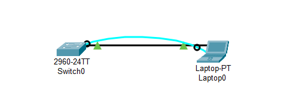
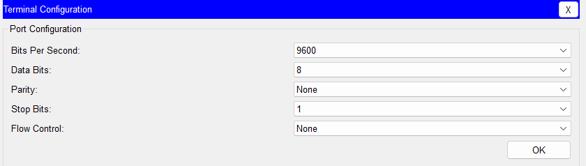
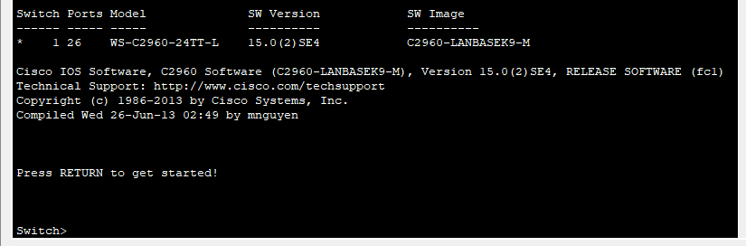
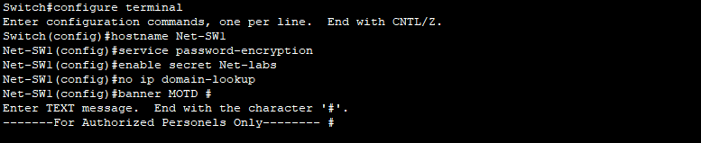
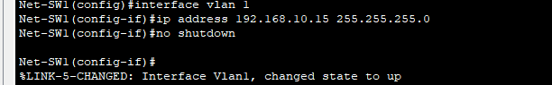
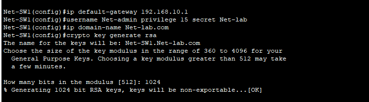
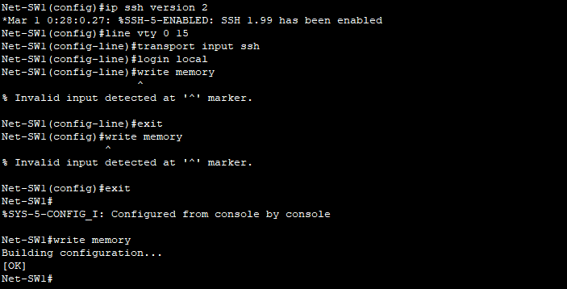
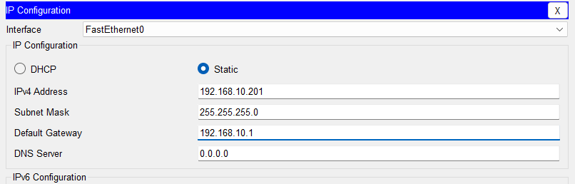
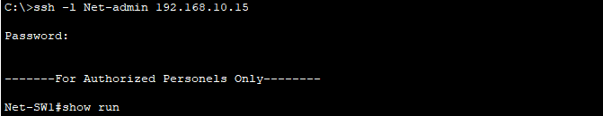
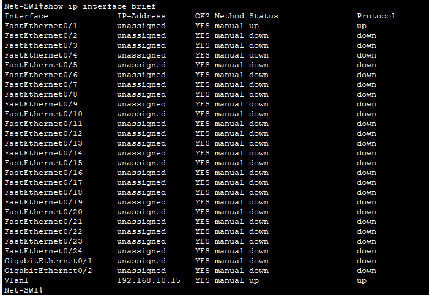

# Basic Switch Configuration 

### Objectives
  - Simulating a console connection to a switch using Packet Tracer.
  - Understanding and configuring basic switch settings.
  - Learn to configure hostname, IP addresses, MOTD and passwords.
  - Practice using show commands to verify switch configurations.

### Software Requirements:

- CISCO Packet Tracer

### Lab Setup



### Step 1: Simulating the Console Connection Using Packet Tracer
-----
  1. Open Cisco Packet Tracer and Create a Topology
  - Launch Packet Tracer.
  - Add the following devices to your workspace:
     - A Cisco 2960 Switch.
     - A Laptop.
     - A Console Cable.
     - A Straight Through cable

2. Connect the Laptop to the Switch Using a Console Cable
  -  In Packet Tracer, select the Console Cable from the cable options.
  - Click on the Laptop and connect the cable to the RS-232 port (aka the console port).
  - Click on the Switch and connect the other end to the Console Port.
3. Access the Switch via the Terminal on the Laptop
  - Click on the laptop.
  - Go to the Desktop tab and click on the Terminal application.
  - Configure the terminal settings (leave the default settings: 9600 Bits per second, 8 data bits, 
parity none,stop bit 1).



  - You should now have access to the switch’s CLI (Command Line Interface).



### Part 2: Verify the default switch configuration.
----
 In this step, you will examine the default switch settings, such as current switch configuration, IOS
information, interface properties, VLAN information, and flash memory.

```
Switch > enable
```

This command allows you to access Privileged EXEC Mode, where you can execute higher-level
commands. By default, the switch starts in User EXEC Mode with limited access

- Examine the current running configuration file.

 ```
 Switch# show running-config
 ```

- Examine the startup configuration file in NVRAM.
Switch# show startup-config
-  Examine the Cisco IOS version information of the switch.

```
Switch# show version
```

- Examine the default VLAN settings of the switch.

```
Switch# show vlan
```

-  Examine flash memory.

``` 
Switch# show flash
```

### Step 2 : Configure Basic Network Device Settings
-----
Configure basic switch settings including hostname, local passwords and MOTD (Message of the Day) banner.

```
Switch# configure terminal
```

-  Assign the switch hostname.

```
Switch(config)# hostname Net-SW1
```

-  Configure password encryption.

```
Net-SW1(config)# service password-encryption
```

- Assign **Net-labs** as the secret password for privileged EXEC mode access.

```
Net-SW1(config)# enable secret Net-labs
```


This sets an encrypted password for accessing Privileged EXEC Mode. Encrypting the password
adds a layer of security.

- Prevent unwanted DNS lookups.

```
Net-SW1(config)# no ip domain-lookup
```

- Configure a MOTD banner.

```
Net-SW1(config)# banner motd#
Enter Text message. End with the character ‘#’.
-----For Authorized Personels Only----- #
```


- Console port access should also be restricted. The default configuration is to allow all console
connections with no password needed. To prevent console messages from interrupting
commands, use the logging    synchronous option.

```
Net-sw1(config)# line con 0
Net-SW1(config-line)# password Net-lab
Net-SW1(config-line)# login local
Net-SW1(config-line)# logging synchronous
Net-SW1(config-line)# exit
Net-SW1(config)#
```


### Configure an IP Address on VLAN 1

```
Net-SW1(config)# interface vlan 1
Net-SW1(config-if)# ip address 192.168.10.15 255.255.255.0
Net-SW1(config-if)# no shutdown
Net-SW1(config-if)# exit
```


VLAN 1 is the default VLAN on most switches. Assigning an IP address to VLAN 1 allows you to
remotely manage the switch. The no shutdown command ensures the interface is activated.

### Configure a Default Gateway
```
Net-SW1(config)# ip default-gateway 192.168.10.1
```

The default gateway allows the switch to communicate with devices outside its local network,
enabling remote management from different subnets.

### Enable Remote Management SSH (more secure):
#### Enable SSH for remote access
#### Create a local user
```
Net-SW1(config)#username Net-admin privilege 15 secret Net-lab
```
#### Create a domain name
```
Net-SW1(config)#ip domain-name Net-lab.com
```

### Generate RSA keys for SSH
```
Net-SW1(config)#crypto key generate rsa
- The name for the keys will be: Net-SW1.Net-lab.com
- Choose the size of the key modulus in the range of 360 to 2048 for your
- General Purpose Keys. Choosing a key modulus greater than 512 may take a few minutes.
- How many bits in the modulus [512]: 1024
- % Generating 1024 bit RSA keys, keys will be non-exportable...[OK]
```



### Enable SSH for remote access:

```
Net-SW1(config)#ip ssh version 2
Net-SW1(config)#line vty 0 15
Net-SW1(config-line)#transport input ssh
Net-SW1(config-line)#login local
Net-SW1(config-line)#exit
Net-SW1(config)#exit
Net-SW1#write memory
```



### Test Remote Access for SSH

click on the Desktop tab and navigate to **ip configuration** and set the ip, subnet mask and gateway to be one the same network.




Add a straight-through cable then  go back to the desktop and click on the command prompt then run

```
PC> ssh -l Net-admin 192.168.10.15
```


Enter the password to access the switch securely via SSH.

#### Verification commands:

```
Net-SW1# show ip interface brief
Switch# show run
```


---
### Notes
  This version of cisco switch used in this demonstration is old, but still in use, Modern system do not come with R232 port anymore that was used here but the some make use of Usb to Usb

---
Next: placeholder

---