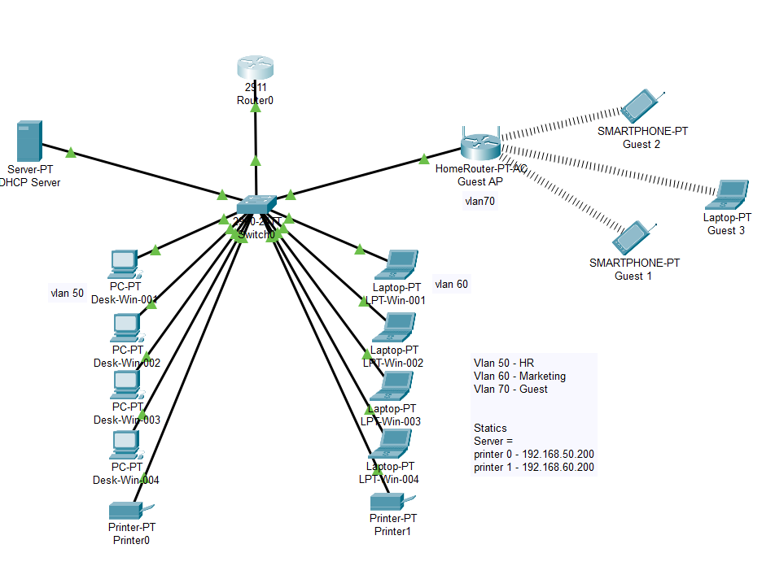

# DHCP and inter-Vlan Configuration

### Objective
This setup will allow you to understand how devices in a network can automatically
obtain IP addresses and other network configuration details from a DHCP server.

### Software Requirements:
- CISCO Packet Tracer

### Lab Setup



### Step-by-Step Instructions
#### Step 1: Add Devices to the Workspace

1. Open Cisco Packet Tracer.
2. From the End Devices section, drag and drop the following devices onto the
workspace:
- Add the devices required for each VLAN/subnet (e.g., three PCs for this homelab).
- Add a Server to configure as the DHCP server.
3. From the Network Devices section, drag and drop:
- Drag a Router (e.g., 2911 or 1941) into the workspace.
- Add a Switch (e.g., 2960).
4. From the Wireless Devices section, drag and drop:
-  Drag a Home-Router-PT-AC
#### Step 2: Physically Connect Devices
1. Click on the cable icon and select a copper straight-through cable.
2. Connect the following devices using the copper straight-through cable.
● Router (GigabitEthernet 0/0) to the Switch (GigabitEthernet 0/1).
● Each Device to the Switch.
● The Server to the Switch.

### Step 3: Configure the VLANs on the Switch
#### Access the Switch:
● Click on the switch to open the configuration window.
● Select the CLI (Command Line Interface) tab.
Create VLANs:
● Enter global configuration mode and adding a hostname
```
Switch>enable
Switch#configure terminal
Switch(config)#
Switch(config)#hostname Net-SW
```

● Create VLANs for each subnet:
```
Net-SW(config)#vlan 10
Net-SW(config-vlan)#name Staff
Net-SW(config-vlan)#vlan 20
Net-SW(config-vlan)#name Students 
Net-SW(config-vlan)#vlan 30
Net-SW(config-vlan)#name Guest
Net-SW(config-vlan)#do wr
```


