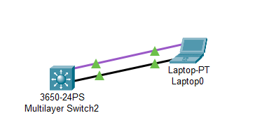
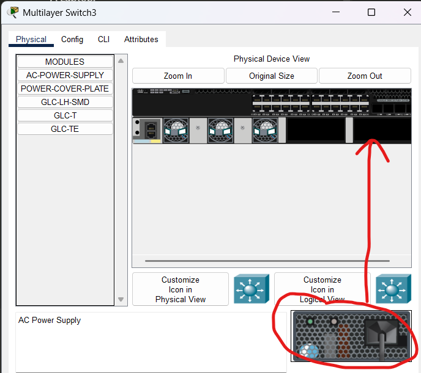
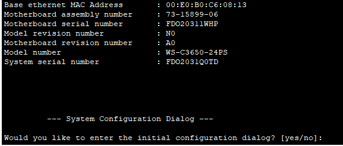
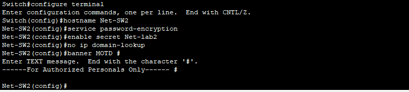
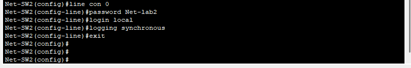
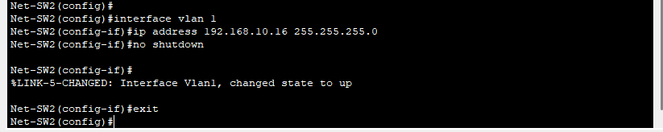
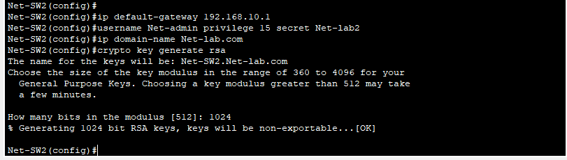
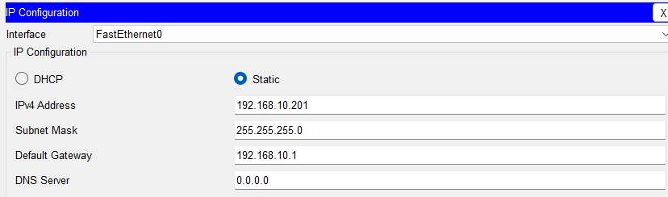
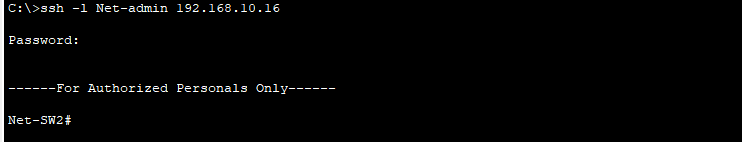
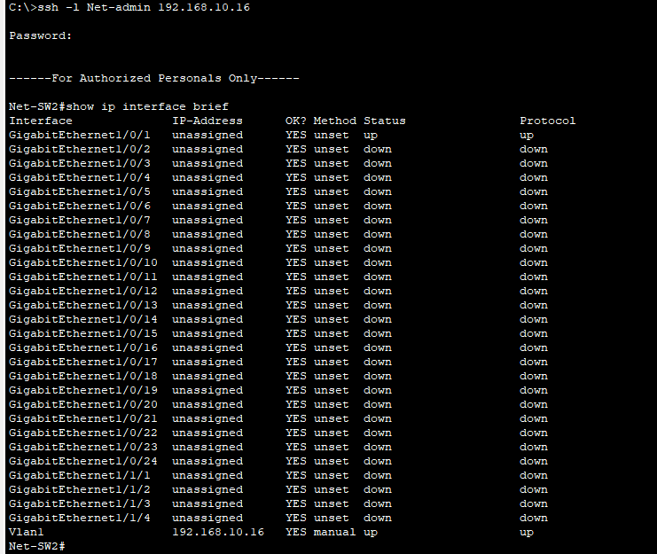

# Switch 3650-24ps Configuration

### Objectives
  - Simulating a Modern USB connection to a switch using Packet Tracer.
  - Understanding and configuring basic switch settings.
  - Learn to configure hostname, IP addresses, MOTD and passwords.
  - Practice using show commands to verify switch configurations.


### Software Requirements:

- CISCO Packet Tracer

### Lab Setup



### Step 1: Simulating the USB Connection Using Packet Tracer
-----
- **Note** : This configuration is 90% a repeat of the previous process, follow along still step 2 then repeat from the previous process.

1. Open Cisco Packet Tracer and Create a Topology
  - Launch Packet Tracer.
  - Add the following devices to your workspace:
     - A Cisco Multilayer 3650-24ps Switch.
     - A Laptop.
     - A USB cable

2. Connect the Laptop to the Switch Using a USB Cable
  -  In Packet Tracer, select the USB Cable from the cable options.
  - Click on the Laptop and connect the cable to any of the USB port.
  - Click on the Switch and connect the other end to the USB Port.
3. Power on the Switch
  - click on the switch
  - In the physical view drag and drop the power supply to the switch 

  

4. Access the Switch via the Terminal on the Laptop
  - Click on the laptop.
  - Go to the Desktop tab and click on the Terminal application.
  - Configure the terminal settings (leave the default settings: 9600 Bits per second, 8 data bits, 
parity none,stop bit 1).


  - You should now have access to the switch’s CLI (Command Line Interface).

  

    
### Step 2 : Configuring The Network Device Settings

Type  **no** to not enter the initial configuration dialog

-----
Configure basic switch settings including hostname, local passwords and MOTD (Message of the Day) banner.

```
Switch# configure terminal
```

-  Assign the switch hostname.

```
Switch(config)# hostname Net-SW1
```

-  Configure password encryption.

```
Net-SW2(config)# service password-encryption
```

- Assign **Net-lab2** as the secret password for privileged EXEC mode access.

```
Net-SW2(config)# enable secret Net-lab2
```


This sets an encrypted password for accessing Privileged EXEC Mode. Encrypting the password
adds a layer of security.

- Prevent unwanted DNS lookups.

```
Net-SW2(config)# no ip domain-lookup
```

- Configure a MOTD banner.

```
Net-SW2(config)# banner motd#
Enter Text message. End with the character ‘#’.
-----For Authorized Personals Only----- #
```




```
Net-sw2(config)# line con 0
Net-SW2(config-line)# password Net-lab
Net-SW2(config-line)# login local
Net-SW2(config-line)# logging synchronous
Net-SW2(config-line)# exit
Net-SW2(config)#
```


### Configure an IP Address on VLAN 1

```
Net-SW2(config)# interface vlan 1
Net-SW2(config-if)# ip address 192.168.10.16 255.255.255.0
Net-SW2(config-if)# no shutdown
Net-SW2(config-if)# exit
```


VLAN 1 is the default VLAN on most switches. Assigning an IP address to VLAN 1 allows you to
remotely manage the switch. The no shutdown command ensures the interface is activated.

### Configure a Default Gateway
```
Net-SW2(config)# ip default-gateway 192.168.10.1
```

The default gateway allows the switch to communicate with devices outside its local network,
enabling remote management from different subnets.

### Enable Remote Management SSH (more secure):
#### Enable SSH for remote access
#### Create a local user
```
Net-SW2(config)#username Net-admin privilege 15 secret Net-lab
```
#### Create a domain name
```
Net-SW2(config)#ip domain-name Net-lab.com
```

### Generate RSA keys for SSH
```
Net-SW2(config)#crypto key generate rsa
- The name for the keys will be: Net-SW1.Net-lab.com
- Choose the size of the key modulus in the range of 360 to 2048 for your
- General Purpose Keys. Choosing a key modulus greater than 512 may take a few minutes.
- How many bits in the modulus [512]: 1024
- % Generating 1024 bit RSA keys, keys will be non-exportable...[OK]
```



### Enable SSH for remote access:

```
Net-SW2(config)#ip ssh version 2
Net-SW2(config)#line vty 0 15
Net-SW2(config-line)#transport input ssh
Net-SW2(config-line)#login local
Net-SW2(config-line)#exit
Net-SW2(config)#exit
Net-SW2#write memory
```


### Test Remote Access for SSH

click on the Desktop tab and navigate to **ip configuration** and set the ip, subnet mask and gateway to be one the same network.




Add a straight-through cable then  go back to the desktop and click on the command prompt then run

```
PC> ssh -l Net-admin 192.168.10.16
```



Enter the password to access the switch securely via SSH.

#### Verification commands:

```
Net-SW2# show ip interface brief
Net-SW2# show run
```



---
Prev : placeholder Next: placeholder

---